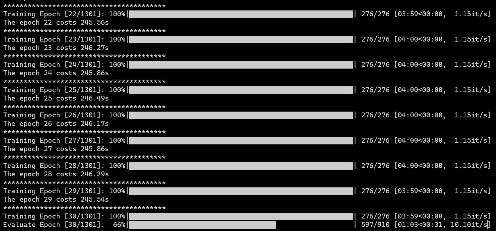
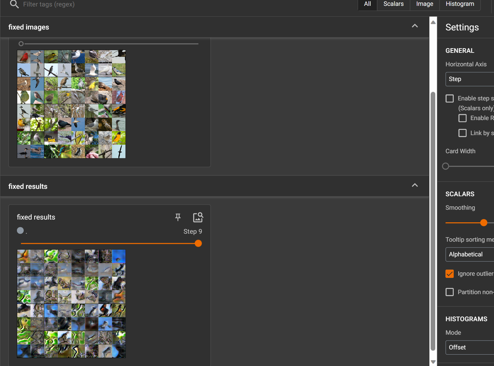
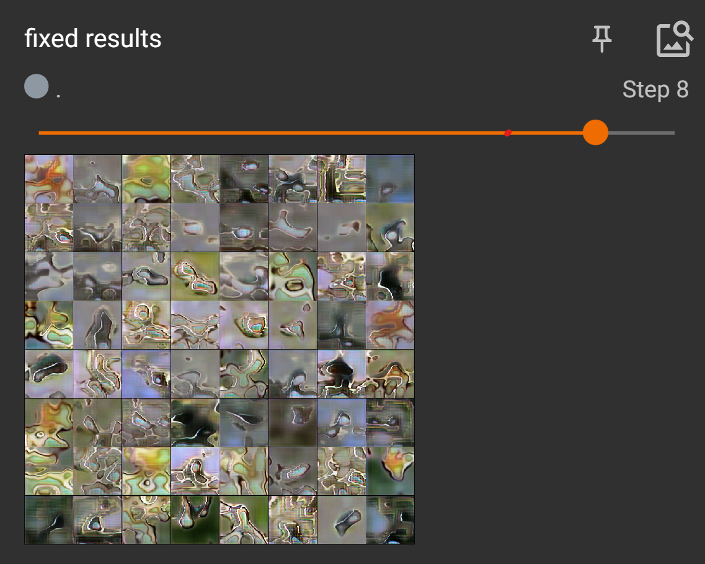
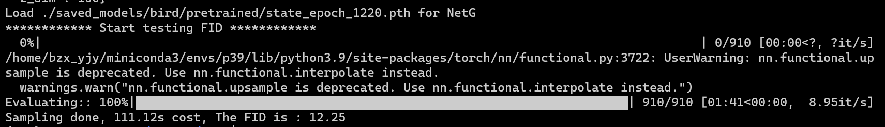
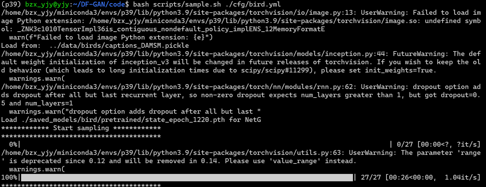
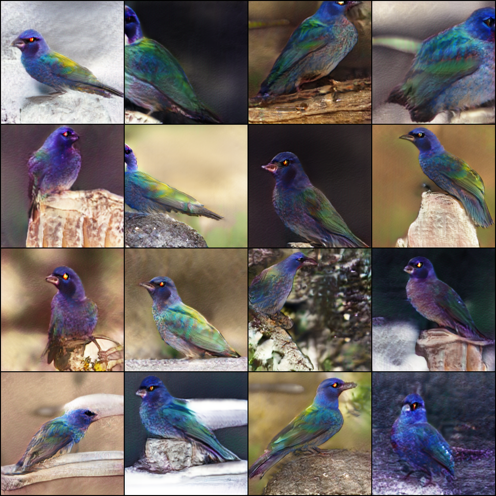

*Last updated:20231031*

### Requirements

官方代码仓中的环境配置：

- python 3.8
- Pytorch 1.9
- At least 1x12GB NVIDIA GPU

```
git clone https://github.com/tobran/DF-GAN
pip install -r requirements.txt
```


复现环境：

- python 3.9
- Pytorch 1.12.0+cu116

11.6的cuda版本无法下载1.9版本的torch，因此使用了1.12.0版本的torch，需要将requirements.txt中的

```
torch==1.9.0
torchvision==0.10.0
```

这两行等号删除。


安装好依赖后可能会报一些pillow等库的相关错误，解决方法均为下载更旧版本的pillow等库。

---

### 数据集准备

1. Download the preprocessed metadata for [birds ](https://drive.google.com/file/d/1I6ybkR7L64K8hZOraEZDuHh0cCJw5OUj/view?usp=sharing) and extract them to `data/`
2. Download the [birds](http://www.vision.caltech.edu/visipedia/CUB-200-2011.html) image data. Extract them to `data/birds/`

---

### Train

```bash
bash scripts/train.sh ./cfg/bird.yml
```

##### 训练过程截图




由于训练中断后代码被自动删除（暂未知道是什么原因导致，该作者的好几份相似代码都会发生这个情况），单次训练非常缓慢，所以训练日志文件丢失，无法对完整的训练日志进行tensorboard可视化，<u>因此只节选了10个epoch训练的可视结果</u>，后续评估模型性能使用的是已经预训练1220轮次后存储的最优模型。

```
tensorboard --logdir=./code/logs/bird/train/<对应时间的文件夹> --port 8166
```


代码支持在训练过程中自动进行FID评估，评估结果存储在TensorBoard文件中，路径为`./logs`。

|      | epoch1 | epoch2 | epoch3 | epoch4 | …    |
| ---- | ------ | ------ | ------ | ------ | ---- |
| FID  | 369.92 | 249.05 | 261.97 | 273.65 |      |

FID是一种用于评估图像生成模型质量的指标。它通过比较生成图像的特征分布与真实图像的特征分布之间的差异来度量生成图像的逼真程度。在FID评估中，使用预训练的卷积神经网络（通常是Inception网络）来提取图像的特征表示，然后计算生成图像和真实图像特征表示之间的Fréchet距离。FID值越低，表示生成图像的分布越接近真实图像的分布





---

### Evaluation

##### Download Pretrained Model

[DF-GAN for bird](https://drive.google.com/file/d/1rzfcCvGwU8vLCrn5reWxmrAMms6WQGA6/view?usp=sharing). Download and save it to `./code/saved_models/bird/`

下载`pretrained_bird.zip`后解压到`saved_models`下，运行指令

```bash
bash scripts/calc_FID.sh ./cfg/bird.yml
```

开始评估。

##### 评估部分截图



对预训练模型的评估结果：

|       | FID   |
| ----- | ----- |
| DFGAN | 12.25 |

---

### Sampling

```
cd DF-GAN/code/
```

##### Synthesize images from example captions

- For bird dataset: `bash scripts/sample.sh ./cfg/bird.yml`

##### Synthesize images from your text descriptions

- Replace your text descriptions into the `./code/example_captions/dataset_name.txt`
- For bird dataset: `bash scripts/sample.sh ./cfg/bird.yml`

The synthesized images are saved at ./code/samples.


##### txt2img




根据我输入的一个描述

"A bird with vibrant, multicolored feathers, resembling a living rainbow."

生成的`png27`：




---


#### Citing DF-GAN

```
@inproceedings{tao2022df,
  title={DF-GAN: A Simple and Effective Baseline for Text-to-Image Synthesis},
  author={Tao, Ming and Tang, Hao and Wu, Fei and Jing, Xiao-Yuan and Bao, Bing-Kun and Xu, Changsheng},
  booktitle={Proceedings of the IEEE/CVF Conference on Computer Vision and Pattern Recognition},
  pages={16515--16525},
  year={2022}
}
```

